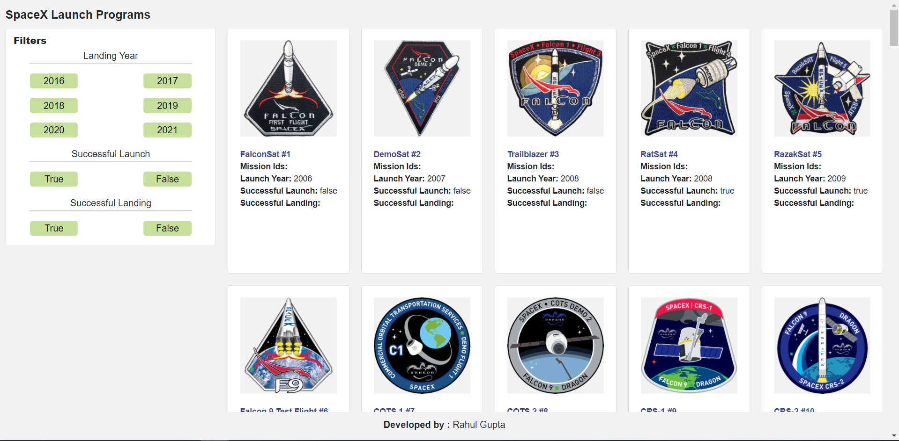

# About : Space X Program

Problem statement: Develop a front-end application which would help users list and browse all launches by SpaceX program.

---

## DEMO PAGE

[SPACE_X_PROGRAM](http://ec2-15-207-29-244.ap-south-1.compute.amazonaws.com:3000/)

### API Used

API end point for the first-time page load without any Filters: `https://api.spaceXdata.com/v3/launches?limit=100`

API end point with Filters applied: 

1. Launch Success Filter: `https://api.spaceXdata.com/v3/launches?limit=100&launch_success=true`
2. Launch & Land Filter: `https://api.spaceXdata.com/v3/launches?limit=100&launch_success=true&land_success=true`
3. All:: `https://api.spaceXdata.com/v3/launches?limit=100&launch_success=true&land_success=true&launch_year=2014`


### Installation

1. Clone the repo 
```sh
git clone https://github.com/rg98098/space_x_program.git
```
2. Install npm packages
```sh
npm install
```

### Run the application

Use this command to run the application : ```npm start ```

### Features

1. Home page


2. Filter by Landing year from URL<br />
    For eg: Filter by launch_year=2019 (http://ec2-15-207-29-244.ap-south-1.compute.amazonaws.com:3000/?launch_year=2019)

3. Filter by Successful Launch from url <br />
    For eg: Filter by launch_success=true (http://ec2-15-207-29-244.ap-south-1.compute.amazonaws.com:3000/?launch_success=true)

4. Filter by Successful Landing from url <br />
     For eg: Filter by land_success=true (http://ec2-15-207-29-244.ap-south-1.compute.amazonaws.com:3000/?land_success=true)

5. Filter by all parameters from url <br />
     For eg: Filter by land_success=true (http://ec2-15-207-29-244.ap-south-1.compute.amazonaws.com:3000/?launch_success=true&land_success=true&launch_year=2019)


## Contributor

- Rahul Gupta <rg98098@gmail.com>